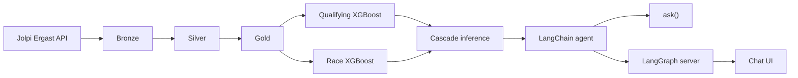
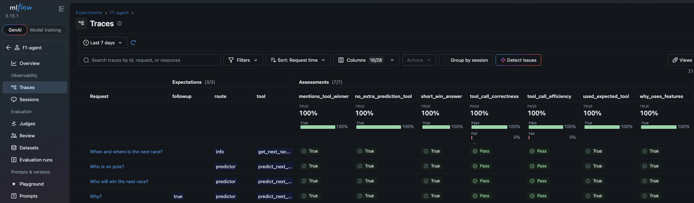
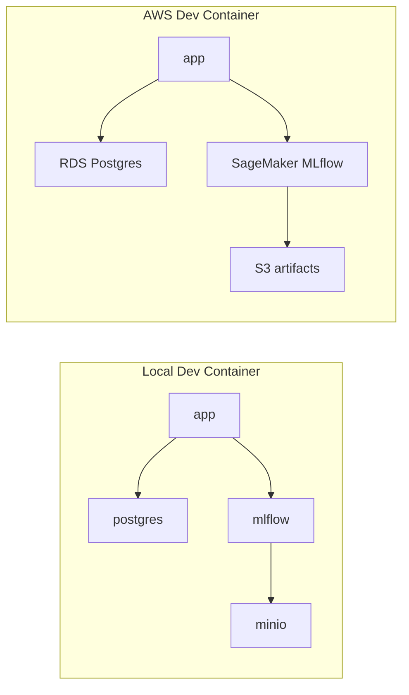

# F1 Predictor

ML-backed F1 race and qualifying predictions with a LangChain agent, built for a fantasy league where we compare model picks to human predictions across categories (podium, pole, and more).

Race and driver data: [Jolpi Ergast API](https://api.jolpi.ca/ergast/f1) (2022–present).

## Table of contents

- [Flowchart](#flowchart)
- [Project structure](#project-structure)
- [Screenshots](#screenshots)
- [Getting started](#getting-started)
- [Extra Documentation](#extra-documentation)

## Flowchart



| Layer | Description |
|-------|-------------|
| **Bronze** | Raw API extracts (current season or historical backfill) → Postgres |
| **Silver** | Cleaned tables with Pandera validation |
| **Gold** | Feature-engineered tables for training |
| **Quali model** | Predicts `qualifying_position` (XGBoost, MAE) |
| **Race model** | Predicts `position`; uses real grid when available, else predicted quali |
| **Agent** | Gemini + tools for schedule, grid, and race predictions |

Both models are XGBoost regressors (`reg:absoluteerror`). **Features and hyperparameters were tuned with top‑3 and top‑10 MAE as the main targets** (`mae_top3`, `mae_top10` in MLflow), matching fantasy-league categories like podium and top‑10 picks — not overall grid MAE alone. Training also logs overall MAE, `mae_p11_plus`, and baseline comparisons.

Training modes (`dev` / `production`).

## Project structure

```
f1_predictor/
├── .devcontainer/       Dev Containers (local Compose stack + aws/ overlay)
├── packages/
│   ├── f1_data/         Bronze/silver pipelines, Postgres storage
│   ├── f1_ml/           Gold pipelines, models, inference
│   └── f1_agent/        LangChain agent, tools, chat UI (`ui/`)
├── notebooks/           train.ipynb, assistant.ipynb, eval.ipynb
├── docs/                setup walkthroughs, extra docs & resources
├── terraform/           optional AWS backend (S3, RDS, SageMaker MLflow)
├── langgraph.json       LangGraph server entrypoint
├── pyproject.toml       uv workspace root
└── uv.lock
```

## Screenshots

### Agent chat

Podium prediction and a follow-up in the chat UI (`http://localhost:3000`):


Next race schedule from the agent (`get_next_race_info`):


### MLflow metrics

Holdout metrics for the qualifying model (`http://localhost:5001`):


Holdout metrics for the race model:


End-to-end cascade eval (predicted grid → race):


Agent Traces Evaluation:



## Getting started

Choose a backend, then follow the matching walkthrough.

| | Local | AWS |
|---|--------|-----|
| **Stack** | Compose Postgres, MinIO, MLflow | RDS Postgres, SageMaker MLflow, S3 |
| **Dev Container** | **F1 Predictor** | **F1 Predictor (AWS)** |
| **Guide** | [Local setup](docs/local-setup.md) | [AWS setup](docs/aws-setup.md) |



Chat UI and LangGraph run in `app` in both modes ([localhost:3000](http://localhost:3000) / [localhost:2024](http://localhost:2024)). MLflow `:5001` and MinIO `:9001` are local-only.

## Extra Documentation

| Doc | Contents |
|-----|----------|
| [Local setup](docs/local-setup.md) | Docker Dev Container: Postgres, MinIO, MLflow |
| [AWS setup](docs/aws-setup.md) | Terraform + AWS Dev Container: RDS, SageMaker MLflow, S3 |
| [Useful commands](docs/usefull-commands.md) | Train, predict, assistant, tests, lint, env vars |
| [Limitations and next work](docs/limitations-and-next-work.md) | Known gaps (data, models, inference) and planned improvements |
| [f1_data](packages/f1_data/README.md) | Bronze/silver pipelines |
| [f1_ml](packages/f1_ml/README.md) | Gold, training, inference |
| [f1_agent](packages/f1_agent/README.md) | Agent tools and chat UI |
