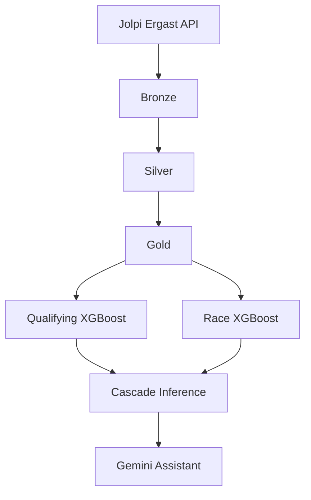

# F1 Predictor

Machine learning system that predicts Formula 1 qualifying and race finishing positions, exposed through a natural-language assistant powered by Gemini.

The project ingests historical F1 data from the [Jolpi Ergast API](https://api.jolpi.ca/ergast/f1), engineers driver and constructor features, trains two XGBoost regressors in a qualifying → race cascade, and serves predictions via function-calling tools so the LLM never invents results.

## Architecture



**Cascade design:** The race model uses qualifying grid position as its direct grid input. At inference time, grid order is not known — so the qualifying model runs first, its predictions are written into `qualifying_position`, and the race model runs on that augmented frame. This mirrors how the cascade is evaluated in `src/models/cascade/evaluate.py`.

## Data pipeline

Data is stored locally as JSON under `data/` via a storage abstraction (`src/storage/`). The pipeline follows a medallion layout:

| Layer | Purpose | Key paths |
|-------|---------|-----------|
| **Bronze** | Raw API extracts, one file per year | `data/bronze/{races,race_results,qualifying_results,constructors}/` |
| **Silver** | Cleaned, validated tables | `data/silver/{race_results,qualifying_results}/data.json` |
| **Gold** | Silver + engineered features for training | `data/gold/{race_results,qualifying_results}/data.json` |

### Bronze (`src/pipelines/bronze/pipeline.py`)

Fetches from `https://api.jolpi.ca/ergast/f1` for seasons 2022 through the current year + 1. Extracts races, race results, qualifying results, and constructors.

### Silver (`src/pipelines/silver/`)

- **Race results** — flattens nested API fields, renames `grid` → `starting_position`, treats grid `0` as missing
- **Qualifying** — parses Q1/Q2/Q3 lap times to seconds, renames `position` → `qualifying_position`

Both layers validate with [Pandera](https://pandera.readthedocs.io/) schemas.

### Gold (`src/pipelines/gold/`)

Inner-joins silver race and qualifying data on `(season, round, driverId, constructorId, circuitId)`, applies model-specific feature builders, and writes training-ready datasets.

## Feature engineering

Features are split into reusable primitives and model-specific orchestration.

### Shared primitives (`src/features/`)

Atomic, entity-level functions with no model coupling. All use lag/shift to avoid target leakage:

- **`drivers.py`** — recent form (last race, rolling 3-race median, season/circuit medians), positions gained, qualifying history
- **`constructors.py`** — team-level position aggregates (rolling and season medians)

### Model orchestration (`src/models/*/features.py`)

| Module | Target | Role |
|--------|--------|------|
| `qualifying_results/features.py` | `qualifying_position` | Composes 7 driver + 1 constructor quali features |
| `race_results/features.py` | `position` | Composes 9 driver + 2 constructor race features |

Both builders accept `for_inference=False` (default — drops rows without a target) or `for_inference=True` (keeps scaffold rows for upcoming races).

Missing values on first circuit visits are filled with sensible fallbacks (e.g. `qualifying_position`) so rookies and new circuits don't break inference.

## Models

Both models are **XGBoost regressors** (`reg:absoluteerror`) wrapped in sklearn `Pipeline`, trained via the shared module in `src/models/training/`.

| | Qualifying | Race |
|---|-----------|------|
| Experiment | `f1-qualifying-results-predictor` | `f1-race-results-predictor` |
| Registered name | `f1_qualifying_predictor` | `f1_position_predictor` |
| Target | `qualifying_position` | `position` |
| Baseline | `driver_last_qualifying_position` | `qualifying_position` |
| Features | 8 | 11 (`qualifying_position` only for grid) |
| Train filter | all rows | finished/lapped statuses only |

Hyperparameters: 500 trees, learning rate 0.1, max depth 6, early stopping (10 rounds). Metrics logged to MLflow include overall MAE plus slices (top 3, top 10, P11+).

### Training modes

| Mode | Split strategy | Use case |
|------|---------------|----------|
| `dev` | Last 50% of rounds in the latest season | Hyperparameter tuning, fast iteration |
| `production` | Hold out the single most recent completed race | Final evaluation and registry |

In `dev` mode, models are saved locally as `.pkl` files. In `production` mode, models are retrained on all data and registered in MLflow.

## Inference

```python
from src.models.cascade.predict import predict_next_race

result = predict_next_race(mode="production")
print(result.winner, result.podium)
print(result.to_dict(top_n=10))
```

**How it works** (`src/inference/next_race.py` + `src/models/cascade/predict.py`):

1. **Resolve target race** — next race on the calendar after the last completed race in gold data, or an explicit `season`/`round`
2. **Build lineup** — 22 drivers from the most recent completed race before the target
3. **Scaffold rows** — placeholder entries with `NaN` results for the target race
4. **Qualifying prediction** — features built from silver history + scaffold, quali model predicts grid
5. **Race prediction** — predicted qualifying position injected into the frame, race model predicts finishing positions

Drivers with incomplete features are dropped with a warning. The result includes predicted qualifying and race positions per driver.

## Assistant

A Gemini-powered chat layer that answers F1 prediction questions by calling the models as tools — never by guessing.

```python
from src.assistant.client import ask

answer = ask("Who will win the next race?")
```

**Tools** (`src/assistant/tools.py`):

| Tool | Backend |
|------|---------|
| `predict_next_race` | Full cascade prediction |
| `get_next_race_info` | Schedule lookup (name, circuit, date) |

Requires a `GEMINI_API_KEY` in a `.env` file at the project root. Default model: `gemini-3.1-flash-lite`.

See `notebooks/assistant.ipynb` for examples.

## Quick start

### Dev container (recommended)

Open the repo in a VS Code / Cursor dev container. It installs dependencies, configures MLflow (`sqlite:///mlflow.db`), and starts the MLflow UI on port 5000.

### Manual setup

```bash
pip install -r requirements.txt
```

Create `.env` if you want the assistant:

```
GEMINI_API_KEY=your_key_here
```

### Run the full pipeline

Open `notebooks/train.ipynb` and run the single cell. This will:

1. Extract bronze data from the API
2. Build silver and gold datasets
3. Train qualifying and race models (`mode="dev"`)
4. Evaluate the cascade end-to-end

Uncomment the production lines in the notebook to retrain on all data and register models.

### Run tests

```bash
pytest                          # all tests
pytest tests/features/          # unit tests only (no data or models needed)
pytest tests/models/            # race model config and feature builder tests
pytest tests/inference/         # needs data/ and dev .pkl models
```

## Project structure

```
f1_predictor/
├── data/                         # Generated locally (gitignored)
├── mlruns/                       # MLflow experiment tracking (gitignored)
├── notebooks/
│   ├── train.ipynb               # Full pipeline + training
│   └── assistant.ipynb           # Predictions + Gemini chat
├── src/
│   ├── assistant/                # Gemini client and tool declarations
│   ├── config/                   # Paths and API constants
│   ├── features/                 # Shared driver/constructor feature primitives
│   ├── inference/                # Next-race schedule, lineup, scaffold logic
│   ├── models/
│   │   ├── cascade/              # predict.py, load.py, evaluate.py
│   │   ├── qualifying_results/   # features.py, train.py
│   │   ├── race_results/         # features.py, train.py
│   │   └── training/             # Shared trainer, splits, metrics
│   ├── pipelines/
│   │   ├── bronze/               # API extraction
│   │   ├── silver/               # Cleaning and validation
│   │   └── gold/                 # Feature engineering for training
│   └── storage/                  # Local JSON storage backend
└── tests/
    ├── features/                 # Unit tests for feature functions
    ├── models/                   # Race model config and feature builder tests
    ├── inference/                # Schedule/lineup and smoke tests
    └── assistant/                # API key guard test
```

## Configuration

| Variable | Purpose | Default |
|----------|---------|---------|
| `GEMINI_API_KEY` | Gemini assistant | Required for `ask()` |
| `MLFLOW_TRACKING_URI` | MLflow backend | `sqlite:///mlflow.db` (devcontainer) |

Data backfill range is set in `src/config/constants.py` (`DATA_START_BACKFILL = 2022`).

## Generated artifacts

These are gitignored and must be produced locally:

- `data/` — run the bronze/silver/gold pipelines
- `mlruns/`, `mlflow.db` — created during training
- `src/models/*/*.pkl` — dev model artifacts
- `.env` — API keys
