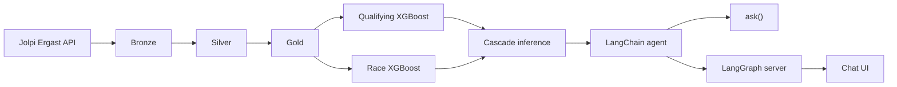
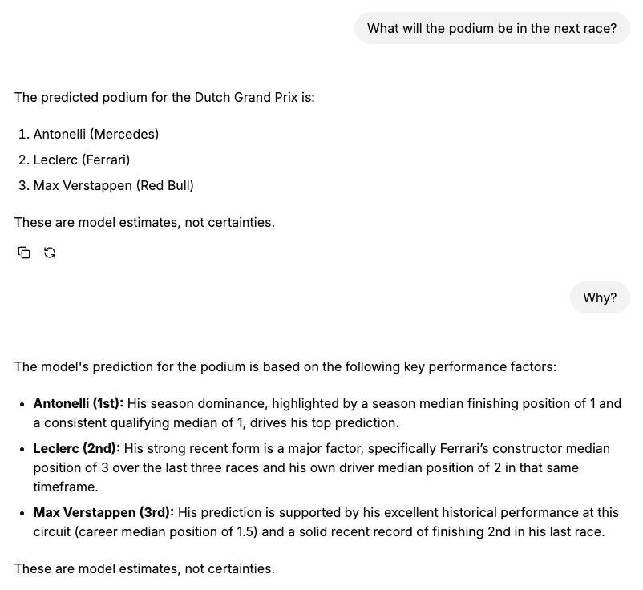
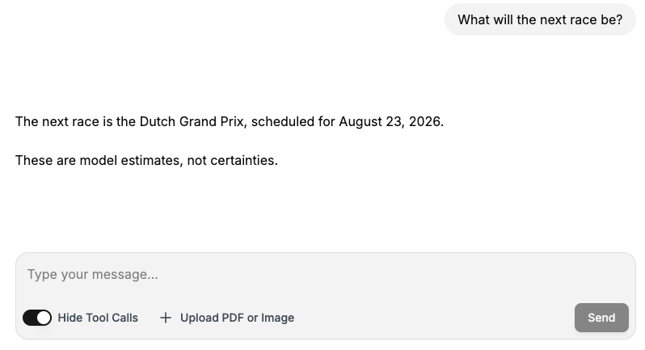
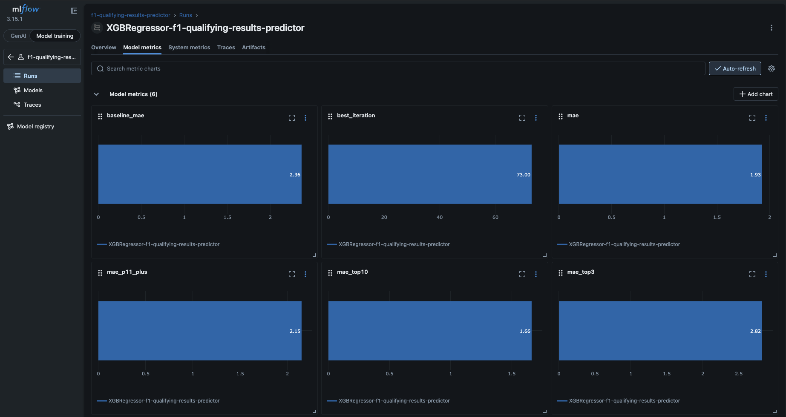
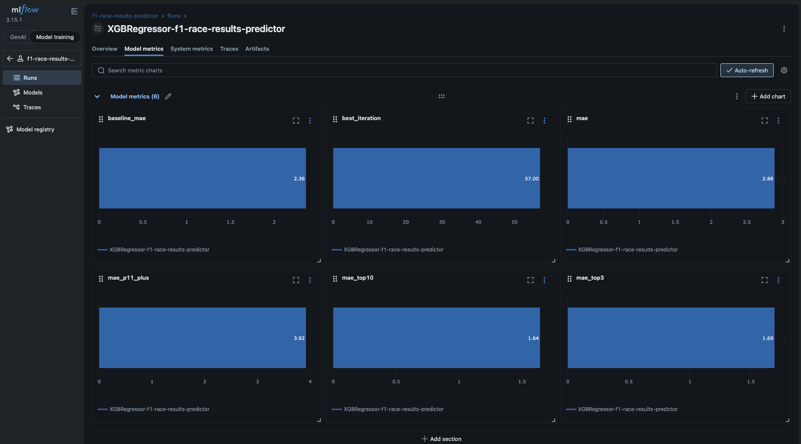
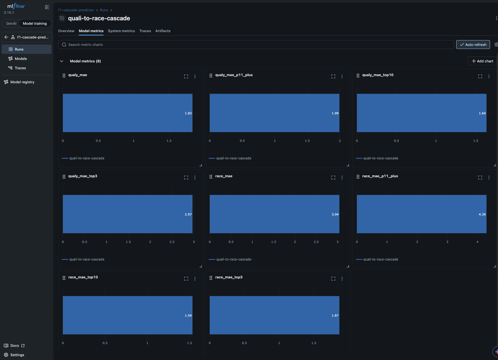

# F1 Predictor

ML-backed F1 race and qualifying predictions with a LangChain agent, built for a fantasy league where we compare model picks to human predictions across categories (podium, pole, and more).

Race and driver data: [Jolpi Ergast API](https://api.jolpi.ca/ergast/f1) (2022–present).

## Table of contents

- [Flowchart](#flowchart)
- [Project structure](#project-structure)
- [Screenshots](#screenshots)
- [Getting started](#getting-started)
  - [Prerequisites](#prerequisites)
  - [Run the project](#run-the-project)
  - [Local URLs](#local-urls)
  - [Dev container stack](#dev-container-stack)
- [Extra Documentation](#extra-documentation)

## Flowchart



| Layer | Description |
|-------|-------------|
| **Bronze** | Raw API extracts (current season or historical backfill) → Postgres |
| **Silver** | Cleaned tables with Pandera validation |
| **Gold** | Feature-engineered tables for training |
| **Quali model** | Predicts `qualifying_position` (XGBoost, MAE) |
| **Race model** | Predicts `position`; uses real grid when available, else predicted quali |
| **Agent** | Gemini + tools for schedule, grid, and race predictions |

Both models are XGBoost regressors (`reg:absoluteerror`). **Features and hyperparameters were tuned with top‑3 and top‑10 MAE as the main targets** (`mae_top3`, `mae_top10` in MLflow), matching fantasy-league categories like podium and top‑10 picks — not overall grid MAE alone. Training also logs overall MAE, `mae_p11_plus`, and baseline comparisons.

Training modes (`dev` / `production`).

## Project structure

```
f1_predictor/
├── .devcontainer/       Dev container + Compose (app, postgres, minio, mlflow)
├── packages/
│   ├── f1_data/         Bronze/silver pipelines, Postgres storage
│   ├── f1_ml/           Gold pipelines, models, inference
│   └── f1_agent/        LangChain agent, tools, chat UI (`ui/`)
├── notebooks/           train.ipynb, assistant.ipynb
├── docs/                extra docs & resources
├── langgraph.json       LangGraph server entrypoint
├── pyproject.toml       uv workspace root
└── uv.lock
```

## Screenshots

### Agent chat

Podium prediction and a follow-up in the chat UI (`http://localhost:3000`):



Next race schedule from the agent (`get_next_race_info`):



### MLflow metrics

Holdout metrics for the qualifying model (`http://localhost:5001`):



Holdout metrics for the race model:



End-to-end cascade eval (predicted grid → race):



## Getting started

### Prerequisites

- **Docker** with Compose — [Docker Desktop](https://www.docker.com/products/docker-desktop/), [OrbStack](https://orbstack.dev/) (macOS), or any Engine with Compose v2
- **Editor with Dev Containers** — [VS Code](https://code.visualstudio.com/) or [Cursor](https://cursor.com/) ([Dev Containers](https://containers.dev/) extension; also [GitHub Codespaces](https://github.com/codespaces))

### Run the project

1. Clone the repo and open it in a dev container (*Dev Containers: Reopen in Container*).
2. Wait for `post-create` (deps + pre-commit) and `post-start` (LangGraph + chat UI).
3. Copy `.env.example` → `.env` and set `GEMINI_API_KEY` for the assistant and chat UI.
4. **Load data and train models** — run `notebooks/train.ipynb` end to end (bronze → silver → gold → train → eval). The dev container does not populate Postgres or register models on its own. On first setup, use bronze backfill if you need history beyond the current season ([Train end-to-end](docs/usefull-commands.md#train-end-to-end)).

Bronze/silver/gold tables, MLflow, and Postgres are provided by the dev container stack — you still run the pipelines and training yourself via the notebook.

### Local URLs

| URL | Service |
|-----|---------|
| [localhost:5001](http://localhost:5001) | MLflow UI |
| [localhost:9001](http://localhost:9001) | MinIO console (`minioadmin` / `minioadmin`) |
| [localhost:3000](http://localhost:3000) | Agent chat UI |
| [localhost:2024](http://localhost:2024) | LangGraph API (graph id `agent`) |

### Dev container stack

| Service | Role |
|---------|------|
| **app** | Python 3.12 workspace (`uv`, notebooks, tests) |
| **postgres** | `f1_predictor` DB (bronze/silver/gold) + `mlflow` DB |
| **minio** | MLflow artifact store (S3-compatible) |
| **mlflow** | Experiment tracking and model registry |
| **LangGraph + UI** | Started in `app` on container boot |

Defined in `.devcontainer/docker-compose.yml`. Postgres schemas and tables are initialized on a fresh volume via `.devcontainer/init-postgres.sh`.

## Extra Documentation

| Doc | Contents |
|-----|----------|
| [Useful commands](docs/usefull-commands.md) | Train, predict, assistant, tests, lint, env vars |
| [Limitations and next work](docs/limitations-and-next-work.md) | Known gaps (data, models, inference) and planned improvements |
| [f1_data](packages/f1_data/README.md) | Bronze/silver pipelines |
| [f1_ml](packages/f1_ml/README.md) | Gold, training, inference |
| [f1_agent](packages/f1_agent/README.md) | Agent tools and chat UI |
