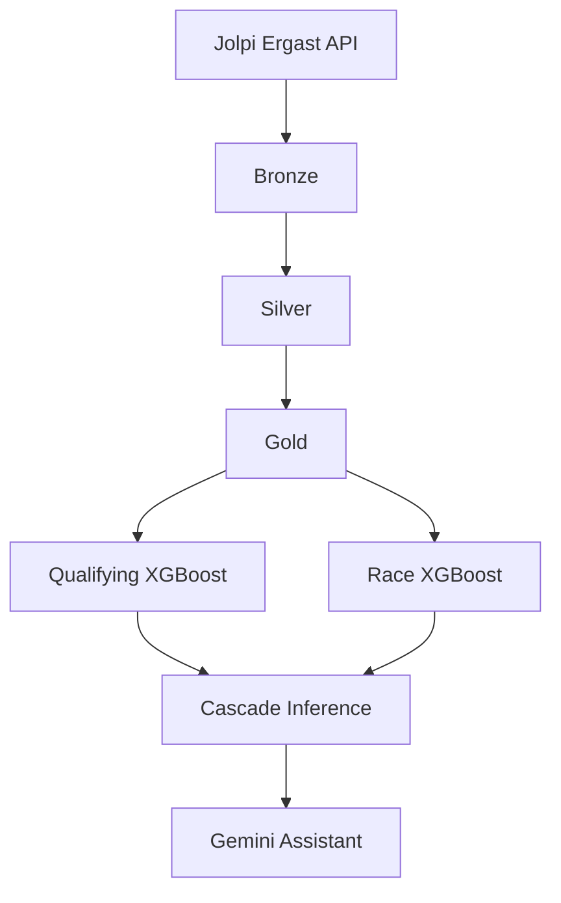

# F1 Predictor

Predicts Formula 1 qualifying and race finishing positions using XGBoost, exposed through a Gemini assistant that calls the models as tools — never by guessing.

Data comes from the [Jolpi Ergast API](https://api.jolpi.ca/ergast/f1) (2022–present). Two regressors run in a **qualifying → race cascade**: the quali model predicts grid order, that feeds the race model, and the assistant surfaces the results in natural language.

## Architecture



At inference time grid order is unknown, so the quali model runs first. Its predictions are written into `qualifying_position`, then the race model predicts finishing positions. See `src/models/cascade/predict.py` and `evaluate.py`.

## Pipeline & models

| Stage | What it does |
|-------|----------------|
| **Bronze** | Raw API extracts; incremental (current season) or optional historical backfill |
| **Silver** | Cleaned tables, Pandera validation |
| **Gold** | Silver inner-join + engineered features for training |
| **Quali model** | 8 features → `qualifying_position` |
| **Race model** | 11 features → `position` (grid input: `qualifying_position` only) |
| **Cascade** | Quali predictions fed into race model at inference/eval |

Features live in `src/features/` (shared primitives) and `src/models/*/features.py` (model-specific). All use lag/shift to avoid leakage; missing values on first circuit visits fall back to `qualifying_position`.

Both models are XGBoost regressors (`reg:absoluteerror`), logged to MLflow with MAE overall and by slice (top 3, top 10, P11+).

| Mode | Split | Output |
|------|-------|--------|
| `dev` | Last 50% of rounds in latest season | Local `-dev.pkl` artifacts |
| `production` | Hold out most recent completed race | Retrain on all data, register in MLflow |

## Quick start

**Dev container (recommended)** — opens with dependencies, MLflow UI on port 5000 (`sqlite:///mlflow.db`).

**Manual setup:**

```bash
pip install -r requirements.txt
```

Optional `.env` for the assistant:

```
GEMINI_API_KEY=your_key_here
```

**Train end-to-end** — run `notebooks/train.ipynb` (bronze → silver → gold → train → cascade eval).

Bronze API (defaults to current season only; silver reads all years already on disk):

```python
bronze_pipeline.extract_bronze_data()  # current season
bronze_pipeline.extract_bronze_data(backfill=True)  # DATA_START_BACKFILL → now
bronze_pipeline.extract_bronze_data(backfill=True, start_backfill_year=2024)
```

Uncomment production lines in the notebook to register models.

**Predict:**

```python
from src.models.cascade.predict import predict_next_race

result = predict_next_race(mode="production")
print(result.winner, result.podium)
```

**Assistant:**

```python
from src.assistant.client import ask

answer = ask("Who will win the next race?")
```

See `notebooks/assistant.ipynb` for examples.

**Tests:**

```bash
pytest                    # full suite
pytest tests/features/    # unit tests only (no data/models)
pytest tests/inference/   # needs local data/ and dev .pkl models
```

**Lint & pre-commit:**

```bash
pip install -r requirements.txt
pre-commit install        # once per clone — runs ruff on every commit
pre-commit run --all-files  # lint/format entire repo manually
```

Config: `pyproject.toml` (`[tool.ruff]`). Hooks: `.pre-commit-config.yaml` (ruff check + format on staged files).

## Project layout

```
f1_predictor/
├── notebooks/          train.ipynb, assistant.ipynb
├── src/
│   ├── assistant/      Gemini client + tools
│   ├── features/       Driver/constructor feature primitives
│   ├── inference/      Next-race schedule, lineup, scaffolds
│   ├── models/         Quali/race train configs, cascade predict/eval
│   └── pipelines/      Bronze, silver, gold
├── plans/              Design notes and roadmaps
└── tests/
```

## Configuration

| Variable | Purpose |
|----------|---------|
| `GEMINI_API_KEY` | Required for `ask()` |
| `MLFLOW_TRACKING_URI` | Default `sqlite:///mlflow.db` in devcontainer |

Backfill start year: `src/config/constants.py` (`DATA_START_BACKFILL = 2022`, used when `extract_bronze_data(backfill=True)`).

**Generated locally (gitignored):** `data/`, `mlruns/`, `mlflow.db`, `src/models/*/*.pkl`, `.env`

---

## README screenshots (optional)

Add images under `docs/screenshots/` and reference them here to make the project easier to skim. Suggested captures from MLflow UI (`http://localhost:5000`):

| Screenshot | Where in MLflow | Why include it |
|------------|-----------------|----------------|
| **Experiments overview** | Home → Experiments list | Shows the three experiments: `f1-qualifying-results-predictor`, `f1-race-results-predictor`, `f1-cascade-predictor` |
| **Single model run — metrics** | Open a quali or race run → Metrics tab | Chart `mae` vs `baseline_mae`; shows the model beats the naive baseline |
| **Slice metrics** | Same run → Metrics | `mae_top3`, `mae_top10`, `mae_p11_plus` — demonstrates performance across the grid, not just overall |
| **Run parameters** | Same run → Parameters | `features`, `mode`, `split_strategy`, `holdout_fraction` — documents what was trained |
| **Cascade eval run** | `f1-cascade-predictor` → latest run | All eight metrics (`qualy_mae_*`, `race_mae_*`) on one screen — end-to-end pipeline quality |
| **Model registry** | Models → Registered Models | Both `f1_qualifying_predictor` and `f1_position_predictor` with version history |

**Nice-to-have:**

- **Compare runs** — overlay two dev runs after a hyperparameter or feature change
- **Assistant output** — screenshot from `assistant.ipynb` showing a podium prediction (complements MLflow)

Example embed once captured:

```markdown

```
